# 🐝 Componentes para Colmeias de meliponicultura em impressão 3D

Este projeto visa aprimorar o manejo de **colmeias de abelhas** (em caixas de madeira padrão) através de componentes funcionais desenvolvidos para **impressão 3D** em **PET-G**.

O projeto é uma iniciativa desenvolvida pela **UNEB (Universidade do Estado da Bahia)**, campus II - Alagoinhas-BA, orientado pelo professor **Peterson Lobato**.

As peças foram desenhadas para otimizar a entrada e saída das abelhas, controlar o acesso, separar as câmaras da colmeia e facilitar a alimentação interna.

---

## 🛠️ Configurações de Impressão 3D

Utilizamos o material **PET-G** devido à sua durabilidade, resistência à umidade e segurança para as abelhas. As especificações de impressão foram testadas com sucesso nas impressoras **Bambu Lab X1 Carbon** e **Creality K1**.

- **Material Recomendado:** PET-G
- **Altura da Camada (Layer Height):** 0,20 mm
- **Diâmetro do Bico (Nozzle Diameter):** 0,4 mm
- **Suportes:** Nenhuma das peças necessita de suportes.
- **Infill (Preenchimento):** 15% para todas as peças, **exceto** o Labirinto de Entrada, que deve ser impresso com **30%** de preenchimento.

---

## 🧩 Peças e Especificações

### 1. Labirinto de Entrada

**Descrição**: Possui um mini labirinto interno para dificultar a entrada de predadores e outros insetos. Conta também com um compartimento projetado para encaixar uma garrafa PET (com um pequeno furo na tampa), permitindo que o alimento vá pingando lentamente para dentro do labirinto.

- **Arquivo STL:** [`labirinto.stl`](./assets/models/labirinto.stl)
- **Preenchimento (Infill):** 30%
- **Dimensões do Modelo STL:** 90 x 74 x 36 mm
- **Dimensões da Peça Impressa:** 90 x 37 x 36 mm

#### Imagens do Modelo STL

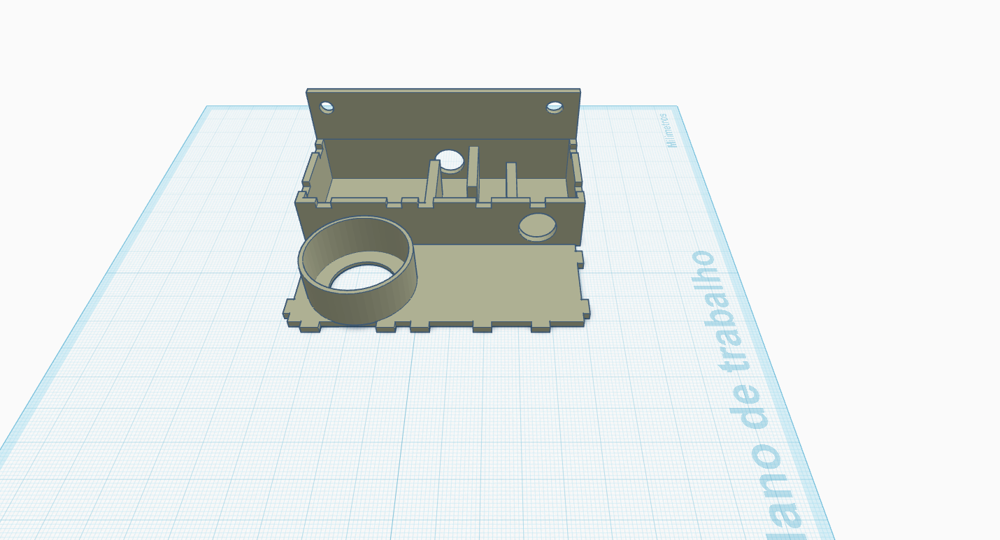
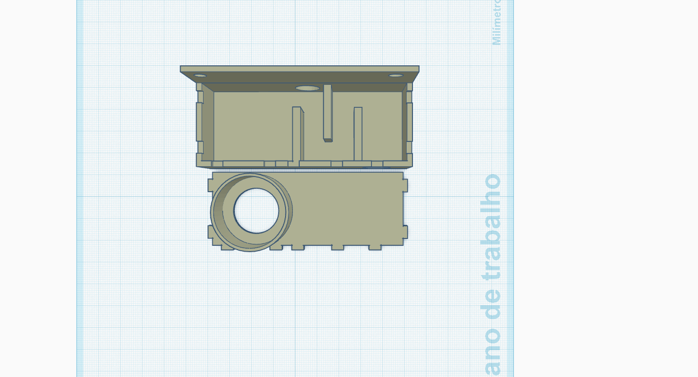

#### Imagens da Peça Impressa

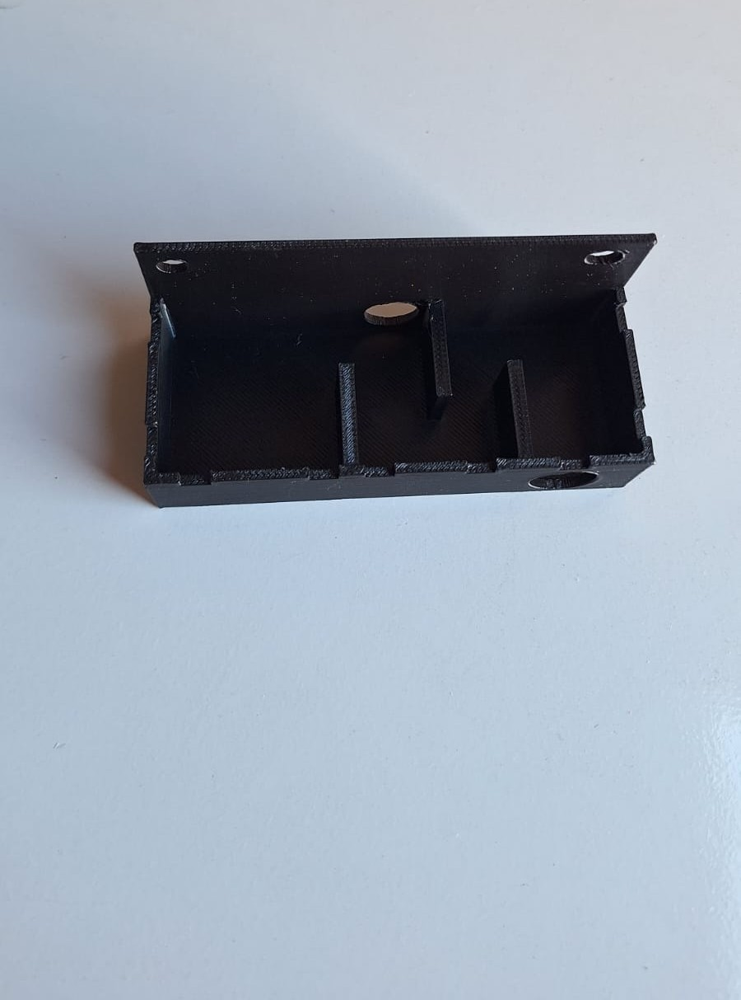
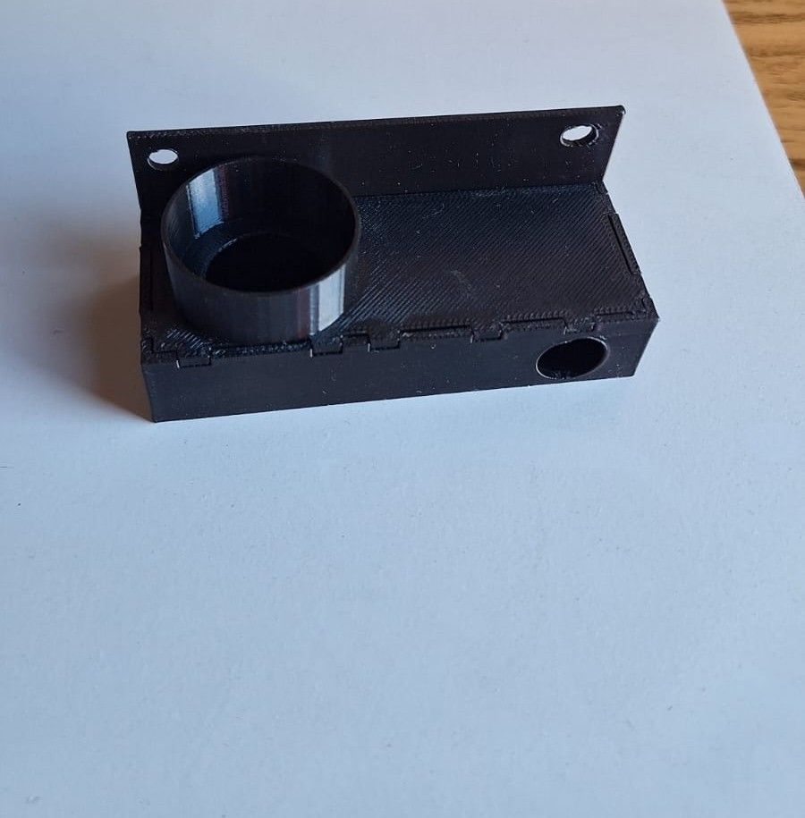
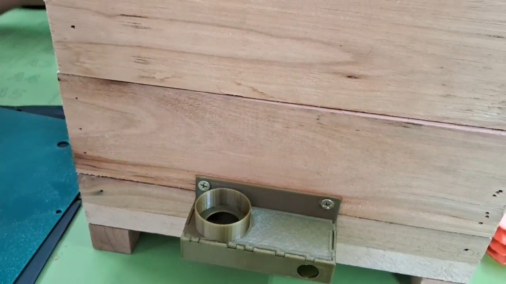

---

### 2. Divisória Melgueira

**Descrição**: Utilizada para separar a área de cria (sobreninho) da área de estoque de mel (melgueira). O design fechado com apenas uma fenda lateral permite o trânsito exclusivo de operárias. Isso impede que a rainha suba para realizar postura nos potes de mel e ajuda a reter o calor na parte inferior da caixa.

- **Arquivo STL:** [`divisoria-melgueira.stl`](./assets/models/divisoria-melgueira.stl)
- **Preenchimento (Infill):** 15%
- **Dimensões (STL e Peça Impressa):** 220 x 220 x 1.5 mm

#### Imagens do Modelo STL

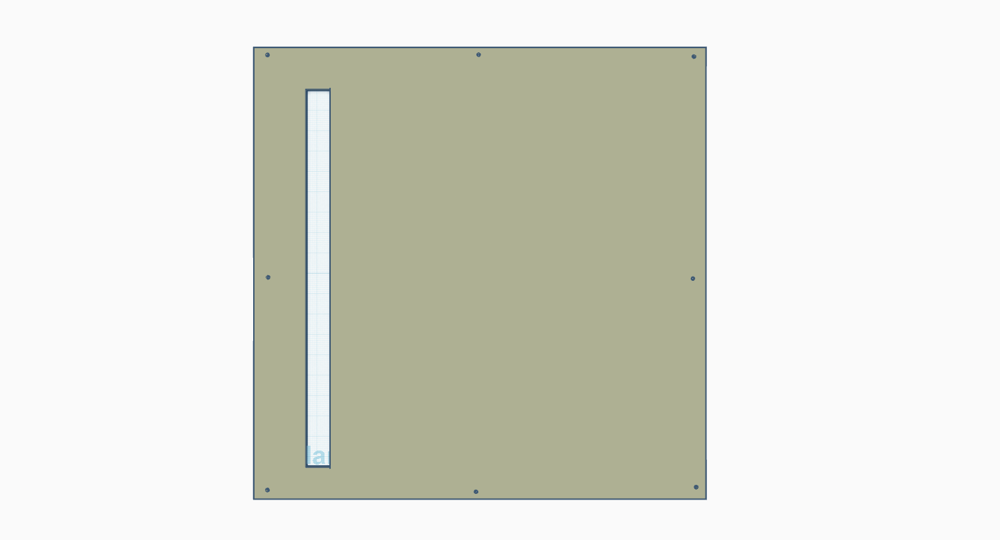

#### Imagens da Peça Impressa

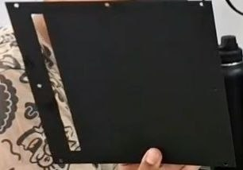

---

### 3. Divisória de Cria Ventilada

**Descrição**: Posicionada entre os módulos de ninho e sobreninho (ou entre múltiplos sobreninhos). O vão central permite a expansão contínua e vertical dos discos de cria. Os furos satélites adicionais atuam como rotas auxiliares e otimizam a circulação de ar, auxiliando a colônia no controle da umidade interna.

- **Arquivo STL:** [`divisoria-cria-ventilada.stl`](./assets/models/divisoria-cria-ventilada.stl)
- **Preenchimento (Infill):** 15%
- **Dimensões (STL e Peça Impressa):** 220 x 220 x 1.5 mm

#### Imagens do Modelo STL

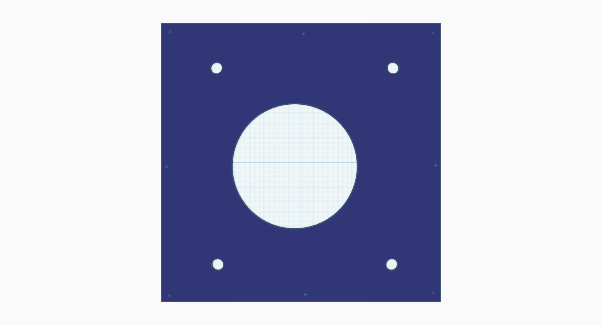

#### Imagens da Peça Impressa

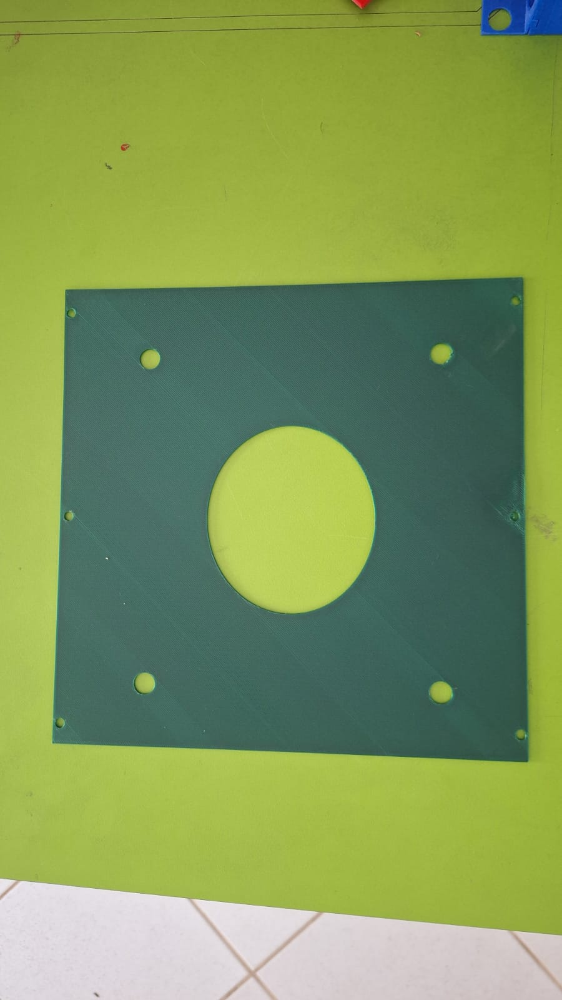

---

### 4. Divisória de Cria Simples

**Descrição**: Também alocada entre os módulos de desenvolvimento (ninho e sobreninhos), porém focada em retenção térmica. A ausência de furos periféricos diminui as correntes de ar, sendo a opção ideal para enxames jovens, divisões recentes ou para a criação de abelhas em regiões de clima mais frio.

- **Arquivo STL:** [`divisoria-cria-simples.stl`](./assets/models/divisoria-cria-simples.stl)
- **Preenchimento (Infill):** 15%
- **Dimensões (STL e Peça Impressa):** 220 x 220 x 1.5 mm

#### Imagens do Modelo STL

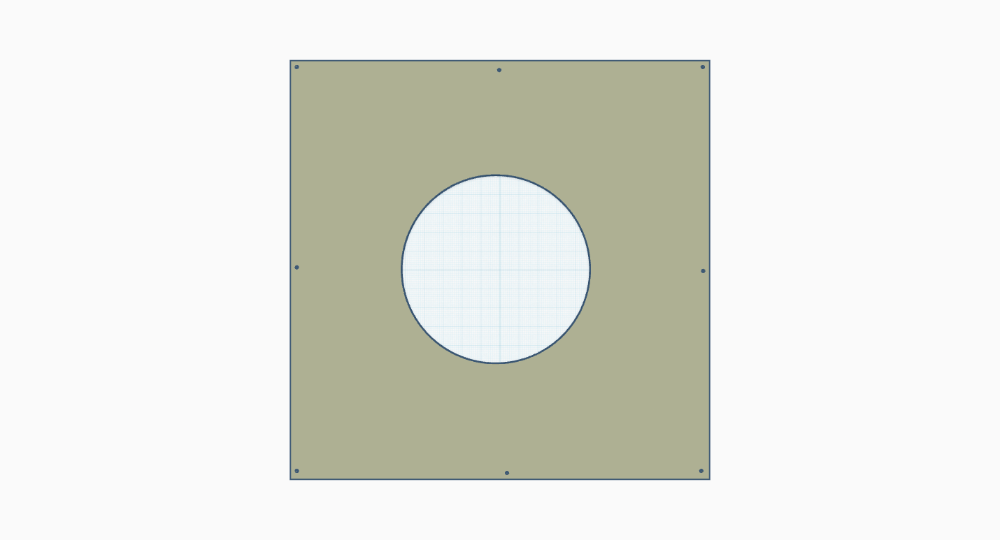

#### Imagens da Peça Impressa

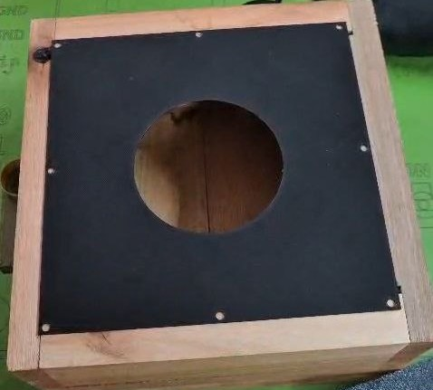

---

### 5. Alimentador Interno Pequeno

**Descrição**: Recipiente para colocar xarope ou alimento sólido (cândi) dentro da colmeia, permitindo que as abelhas se alimentem com fácil acesso e minimizando o risco de afogamento.

- **Arquivo STL:** [`alimentador-pequeno.stl`](./assets/models/alimentador-pequeno.stl)
- **Preenchimento (Infill):** 15%
- **Dimensões (STL e Peça Impressa):** 50 x 50 x 25 mm

#### Imagens do Modelo STL

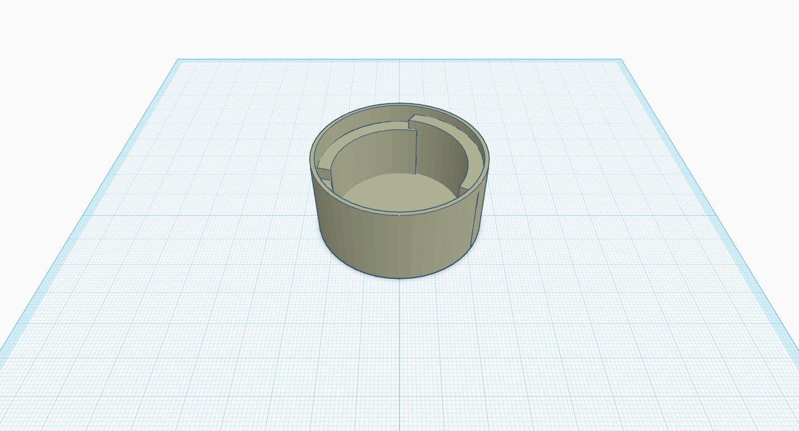
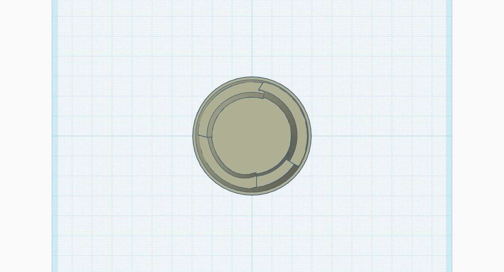

#### Imagens da Peça Impressa

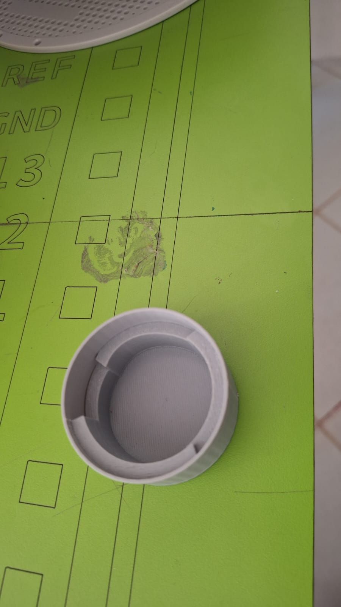

---

### 6. Bico de Entrada

**Descrição**: Agora sem o encaixe que era parafusado, o novo bico se encaixa perfeitamente de forma direta no Labirinto de Entrada. Ajuda a direcionar o tráfego das abelhas e oferece proteção contra intempéries.

- **Arquivo STL:** [`bico.stl`](./assets/models/bico.stl)
- **Preenchimento (Infill):** 15%
- **Dimensões (STL e Peça Impressa):** 77 x 78 x 28 mm

#### Imagens do Modelo STL

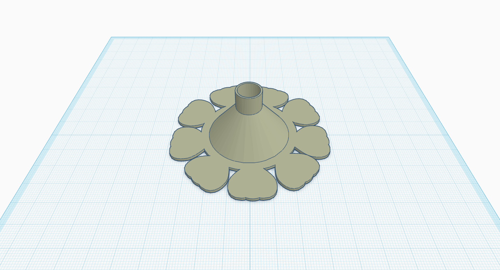
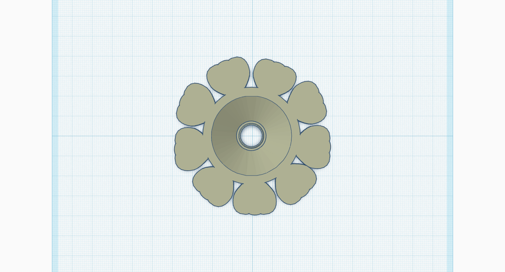

#### Imagens da Peça Impressa

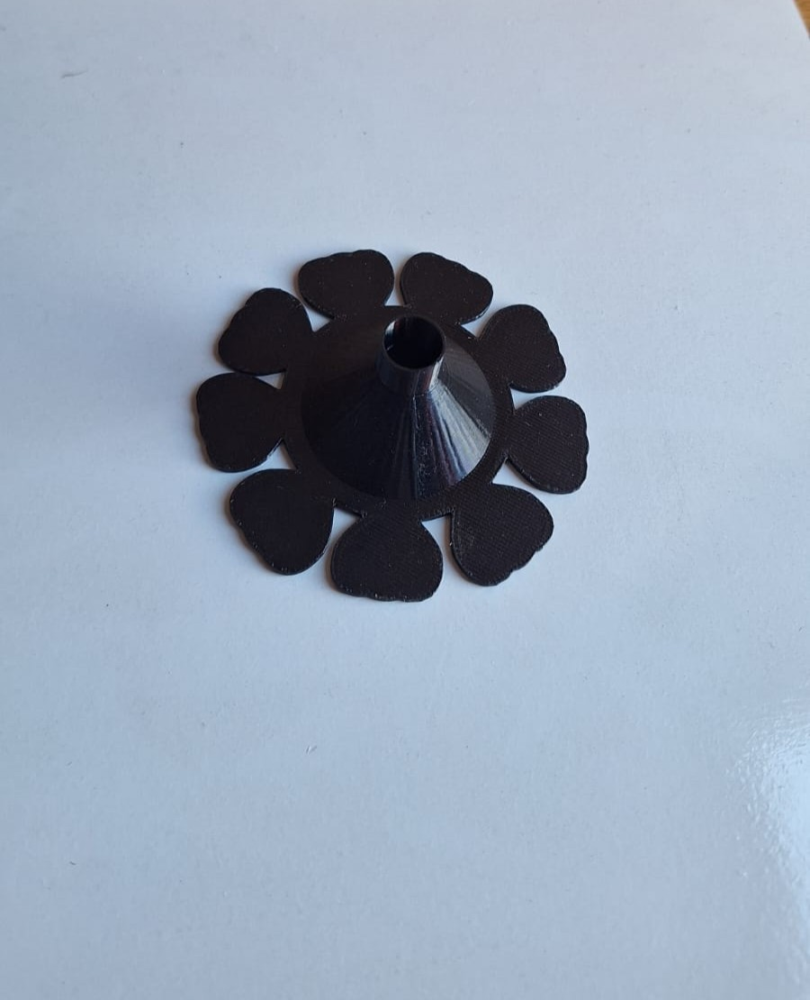
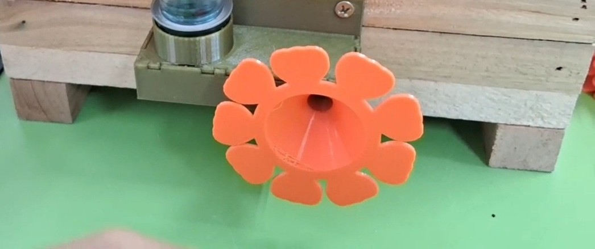

<!-- ---

### 7. Alimentador Interno Grande

**Descrição**: Semelhante ao alimentador pequeno, este modelo é um recipiente para colocar xarope ou alimento sólido (cândi) dentro da colmeia, porém com maior capacidade de armazenamento. Permite que as abelhas se alimentem facilmente e minimiza o risco de afogamento.

- **Arquivo STL:** _A ser adicionado_
- **Preenchimento (Infill):** 15%
- **Dimensões (STL e Peça Impressa):** 50 x 50 x 70 mm

#### Imagens

> _O arquivo STL e as fotos da peça real impressa serão adicionados em breve._ -->

---

## 🎥 Apresentação do Projeto

Assista ao nosso vídeo apresentando os integrantes do projeto, mostrando as peças em detalhes e demonstrando o seu funcionamento na prática:

[Vídeo de Apresentação do Projeto](https://drive.google.com/file/d/1hBeu5EEQWRb104b7kFae6c4P0CHwVrxh/view?usp=drive_link)

---

## 📝 Autoria e Contribuições

Este projeto foi desenvolvido no **Campus II da UNEB**, como parte da disciplina de Projeto de Extensão.

- **Professor Orientador:** Peterson Lobato
- **Discentes Participantes:** Albiery Gonçalves, Cauane Galdino, Leoman Cássio, Joedson Nascimento, Yude Lima

---

## 📄 Licença

Este projeto está licenciado sob a **Licença MIT**.

Para detalhes completos, consulte o arquivo **[LICENSE](LICENSE)**.
